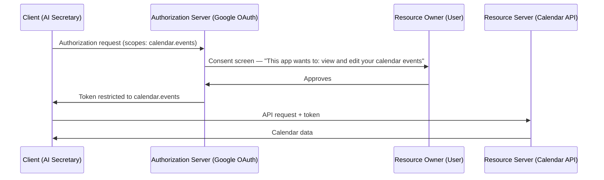
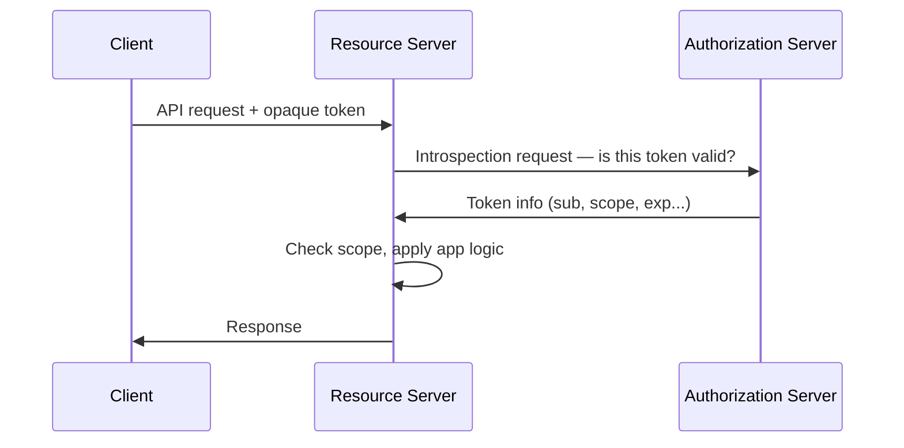
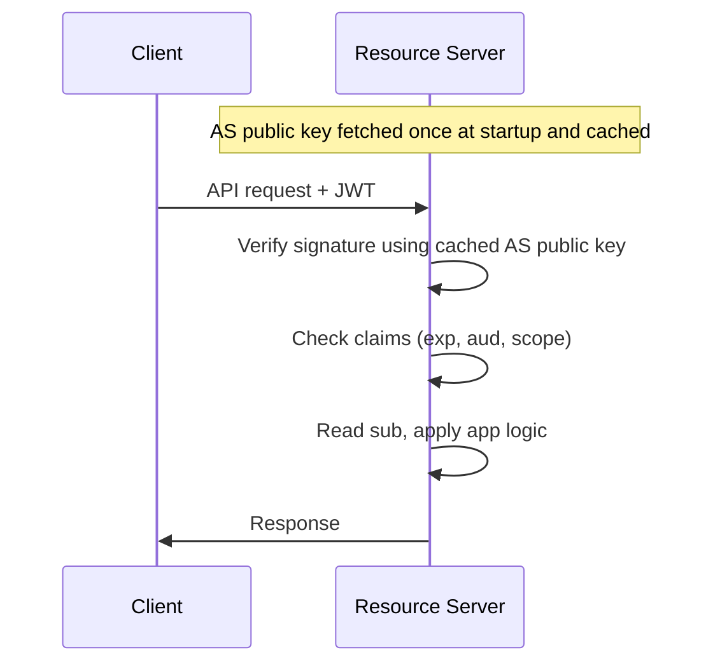
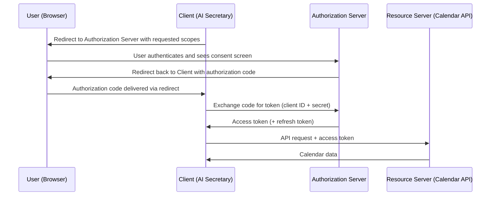
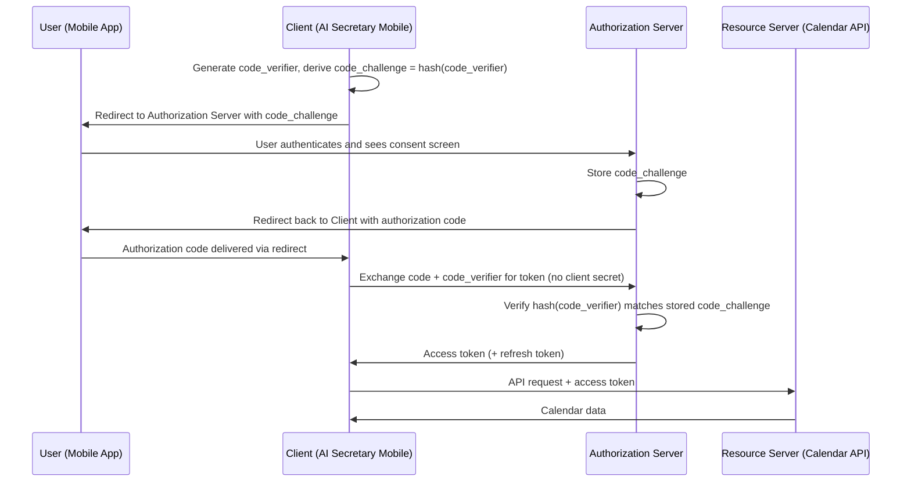
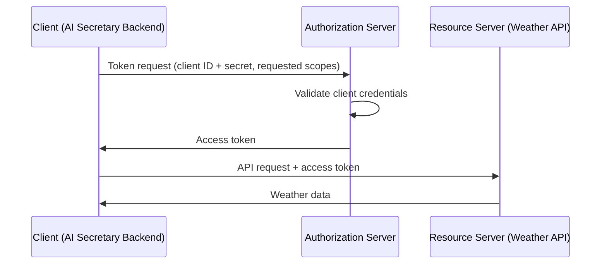
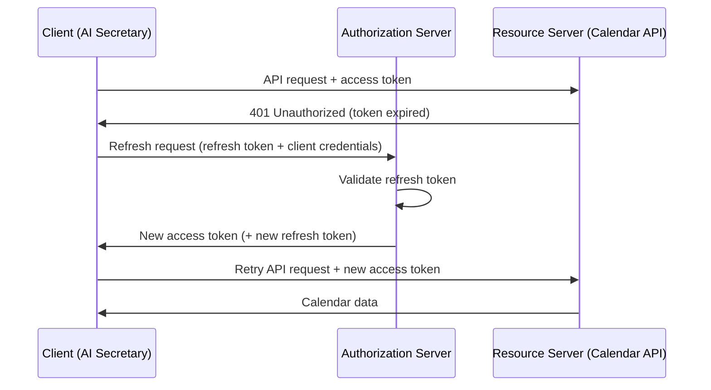
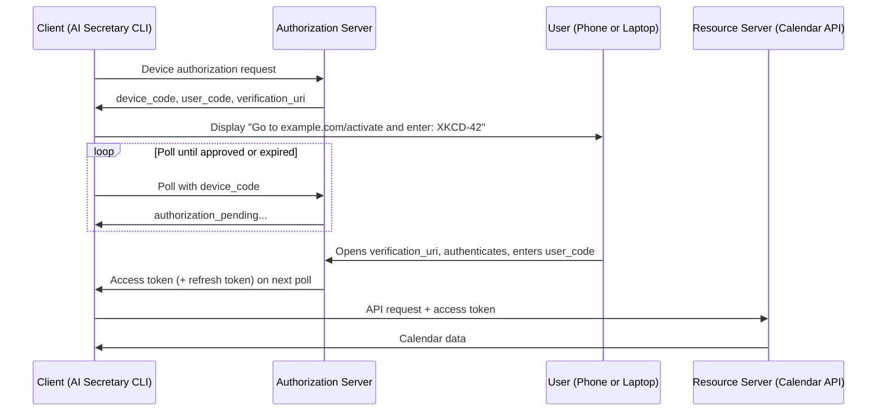
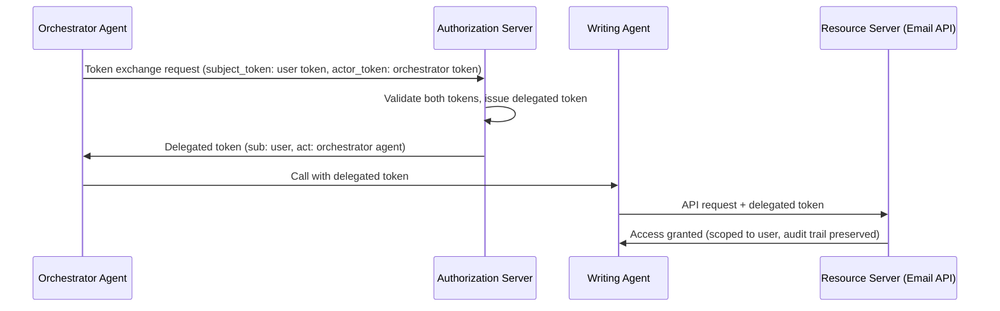
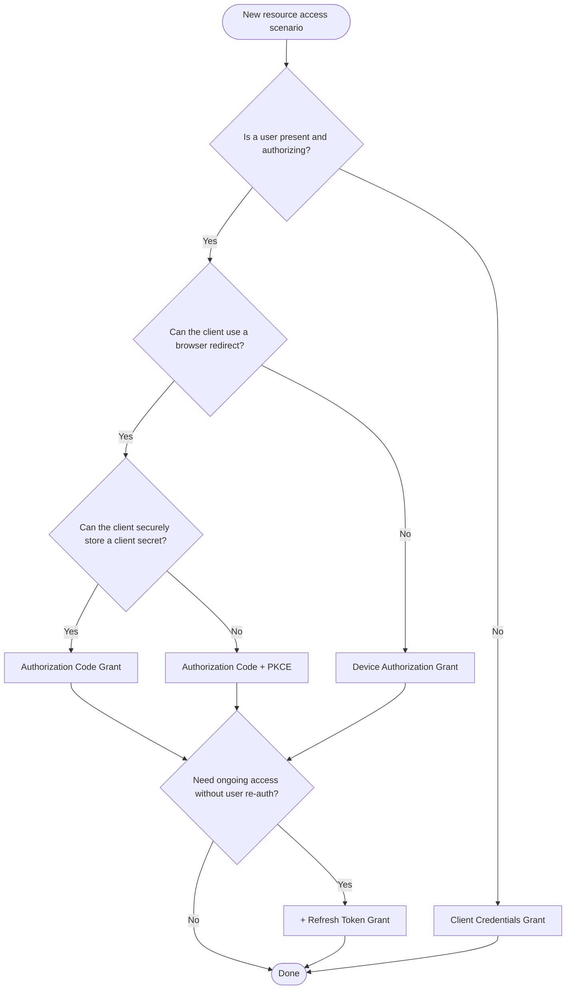

This post is a practical guide to OAuth 2.0 for AI engineers.
It covers the core concepts — roles, scopes, access tokens, and JWTs — and then goes deep on the grant types most relevant to AI and agentic systems: Authorization Code, Authorization Code with PKCE, Client Credentials, Refresh Token, Device Authorization, and Token Exchange. Along the way, it maps each grant type to real agentic scenarios, explains how OAuth 2.0 relates to OpenID Connect, and gives you a decision framework for choosing the right grant type in your own systems.

# OAuth 2.0 from the AI Engineer Perspective

## Introduction

Imagine you're building an AI-powered secretary — a SaaS application that joins your users' calls with their clients and, based on what was discussed, schedules follow-up meetings in their Google Calendar. To do that, your application needs permission to access each user's calendar. Your users probably won't be thrilled about sharing their Google account passwords with your application, no matter how honest your intentions are. And even if they were, you'd want your application to only be able to manage calendar events, not access everything else in their Google account. That permission should also be revocable at any time. How do you design that system?

This is exactly the problem OAuth 2.0 was built to solve. OAuth 2.0 is the industry standard protocol for authorization. It defines a set of rules and workflows — called grant types — that cover scenarios such as a client application obtaining delegated permission to access user-owned resources on behalf of that user, without ever handling their credentials, or a client application accessing its own resources directly. Each grant type is designed for a specific scenario: a user authorizing a web app, a backend service calling another service, a CLI tool running on a device without a browser, or an agent delegating access to another agent.

As an AI engineer, you'll encounter these scenarios constantly. An agent accessing user data, a pipeline of agents where one needs to act on behalf of another, a background service making API calls without any user present — each of these requires a different authorization approach, and picking the wrong one leads to systems that are either insecure, brittle, or both. In this post, we'll cover the OAuth 2.0 grant types most relevant to AI engineering: Authorization Code, Authorization Code with PKCE, Client Credentials, Refresh Token, Device Authorization, and Token Exchange. Along the way, we'll look at how each one maps to real agentic scenarios.

Authorization is one of those things that's easy to get approximately right and hard to get exactly right. As AI agents become more autonomous, longer-lived, and more deeply integrated with sensitive systems, the cost of getting it wrong compounds. A poorly scoped token, a credential stored in the wrong place, or the wrong grant type chosen for the wrong scenario can quietly become a serious vulnerability. The goal of this post is not just to explain how OAuth 2.0 works, but to give you the mental model to design authorization into your AI systems deliberately — from the start.

## OAuth 2.0 Roles

OAuth 2.0 defines four roles that together describe who owns what, who wants access, and who mediates the whole interaction. Let's ground them in the AI secretary scenario from earlier.

The **Resource Owner** is the entity that owns the protected resource and can grant access to it. In the secretary example, that's your user — the person whose Google Calendar holds their meetings.

The **Client** is the application that wants access to the protected resource, acting on behalf of the Resource Owner with their authorization. In the secretary example, that's your SaaS application. In an agentic system, the agent itself often plays this role: it's the party making API calls and requesting permission to act.

The **Authorization Server** is what mediates trust. It authenticates the Resource Owner, obtains their consent, and issues access tokens to the Client. In the secretary example, that's Google's OAuth infrastructure — the system behind the consent screen your users see when they connect their calendar.

The **Resource Server** is where the protected resources live. It accepts requests from the Client, validates the access token, and either serves the resource or rejects the request. In the secretary example, that's the Google Calendar API. We'll look at exactly how that enforcement works once we cover tokens.

These roles can feel abstract in isolation, so it's worth pausing on a few things that commonly cause confusion.

First, the Authorization Server and Resource Server are logically distinct roles, but they don't have to be run by different systems. In many implementations — including Google's — they're operated by the same provider. What matters is the separation of concerns: the Authorization Server decides whether the Client is allowed to access something; the Resource Server enforces that decision at request time.

Second, and more importantly for AI engineering: the same entity can play different roles depending on which resource access you're looking at. Consider the AI secretary again. When it accesses a user's Google Calendar, the agent is the Client and the user is the Resource Owner — the agent is acting on someone else's behalf. But suppose that same agent also pulls in weather forecasts to help schedule outdoor meetings. The weather API doesn't belong to any user; the agent is accessing it on its own behalf, not delegating from anyone. That's a different kind of interaction entirely — different Resource Server, different Authorization Server, different role configuration.

This is the normal state of an agentic application. An agent typically has many resource access interactions happening across its lifetime, and each one has its own set of roles. One interaction might involve user-delegated access to a calendar. Another might involve the agent accessing a third-party data API directly. A third might involve one agent calling another. Each of these is a separate OAuth interaction with its own Client, Resource Owner, Authorization Server, and Resource Server — and the same entity can appear in different roles across different interactions. Keeping this in mind will make the grant types that follow much easier to reason about: each grant type is really a description of how one particular interaction is authorized, not how an entire system works.

## Scopes

When your AI secretary requests access to a user's Google Calendar, it doesn't just ask for "access to Google." It asks for access to something specific — in Google's case, something like `https://www.googleapis.com/auth/calendar.events`, which grants permission to read and write calendar events. That string is a scope, and it defines the boundaries of what the token the Client receives will be permitted to do (more on tokens in the next section).

Scopes flow through the OAuth process in a predictable way. The Client declares which scopes it needs when it initiates the authorization request. The Authorization Server presents those scopes to the Resource Owner on a consent screen — this is why you see prompts like "This app wants to: view and edit your calendar events." If the user consents, the resulting token is restricted to exactly those scopes.



That's the user-delegated flow. But recall the weather API example from the previous section — the agent accessing forecast data on its own behalf, with no user involved. Scopes still apply here: the agent requests specific scopes when it authenticates with the Authorization Server, and the resulting token is similarly restricted to those scopes. The difference is that there's no consent screen and no user approving anything at runtime. Instead, the scopes the application is allowed to request are pre-configured when the application is registered with the Authorization Server. The token the agent receives is still scoped — just scoped to what the application itself is authorized for, not what a user has delegated.

One thing worth knowing: OAuth doesn't define what scope values should look like or what they mean. The specification only says they're space-delimited strings. Every provider defines their own vocabulary. Google's scopes are long URLs. GitHub's look like `repo` or `read:user`. A custom internal API might use `reports:read` or `calendar:write`. There's no universal scope language — when integrating with a new API, you'll need to consult that provider's documentation to understand what scopes exist and what each one covers.

For AI engineering, scopes are your primary tool for least-privilege access. An agent should request only the scopes it needs for the specific task it's performing — not a broad set "just in case." This matters more than it might seem. An agent with overly permissive access can do more damage if it's compromised, behaves unexpectedly, or is manipulated by a malicious prompt. A narrowly scoped token limits the blast radius. If your AI secretary only needs to create calendar events, it should request `calendar.events` — not full calendar access, and certainly not access to the user's email or drive. The same principle applies to the weather API: even though the agent is acting on its own behalf, it should still request only the scopes it actually needs.

It's also worth noting that scopes declare what a token is permitted to do — but they don't enforce it by themselves. Think of it like a driver's license. The licensing authority — the Authorization Server — issues your license and specifies on it what you're authorized to operate: a car, but not a bus. The license itself is the token, and it carries that permission with it wherever you go. But the licensing authority isn't present every time you drive. When a police officer pulls you over at a checkpoint, they're the Resource Server: they check your license, read what it says, and decide whether you're in compliance. The licensing authority trusted you enough to issue the license; the officer enforces what it says in the real world. We'll cover exactly how that enforcement works in practice when we get to tokens.

## Access Tokens & JWT

Every time the AI secretary makes a request to the Google Calendar API, it includes a credential in the HTTP request — an access token. The Resource Server reads that token to decide whether the request is authorized. But what exactly is an access token, and what does it contain?

The OAuth spec deliberately doesn't mandate a format. A token is just a string the Client presents and the Resource Server validates. What matters is the validation model, and there are two main approaches.

The first produces what's known as a **by-reference token** — a random, opaque string with no inherent meaning. The Resource Server can't read anything from it directly; instead, it calls the Authorization Server to look up what permissions that string maps to. This works, but it means every API call requires a network round-trip to the Authorization Server.

The second produces a **by-value token** — a self-contained token that encodes all the information the Resource Server needs to validate it, signed so that the contents can be trusted without any external lookup. JWT (JSON Web Token) is the most widely used format for by-value tokens, and it's what most OAuth implementations use in practice.

The diagrams below show what validation looks like for each approach:

**By-reference token (opaque)**


**By-value token (JWT)**


**JWT structure**

A JWT is three Base64URL-encoded strings joined by dots: `header.payload.signature`.

The **header** specifies the token type and the signing algorithm — for example, RS256 (RSA with SHA-256).

The **payload** contains claims — statements about the token and the entity it represents. Some standard claims you'll encounter regularly:

- `sub` (subject): who the token represents, typically a user ID
- `iss` (issuer): which Authorization Server issued the token
- `exp` (expiration): a Unix timestamp after which the token is no longer valid
- `aud` (audience): which Resource Server this token is intended for
- `scope`: the permissions the token carries

The **signature** is generated by the Authorization Server using its private key. When the Resource Server receives the token, it verifies the signature using the Authorization Server's public key — typically fetched once from a well-known endpoint and cached locally. If verification passes, the Resource Server knows the token hasn't been tampered with and came from a trusted source, without making any network call.

Here's what a decoded JWT payload might look like in the AI secretary scenario:

```json
{
  "sub": "user_8472",
  "iss": "https://accounts.google.com",
  "aud": "https://www.googleapis.com/",
  "scope": "calendar.events",
  "exp": 1740000000
}
```

**How the Resource Server actually enforces authorization**

Back in the Roles section we said the Resource Server "enforces the authorization decision at request time" and deferred the details. Here's what that actually looks like in practice.

When the Calendar API receives a request, it validates the JWT signature, checks that the token hasn't expired, confirms the `scope` covers the operation being requested, and then reads the `sub` claim — the user's identifier — and uses it in application code to scope the data it returns, querying only calendar events that belong to that user. That last step is plain application logic, not OAuth. OAuth tells the Resource Server who the request is for and what it's allowed to do; what to actually return is up to the application. This is why a narrowly scoped token can't be redirected to access another user's data — the `sub` claim pins it to a specific identity.

**The trade-off: revocation**

Because JWTs are self-contained and validated locally, the Authorization Server has no visibility into whether a token is being used after it's issued. If a token is compromised — or a user explicitly revokes access — the token remains valid until its `exp` timestamp passes.

Revocation is technically possible: you can maintain a server-side blocklist of revoked token identifiers and check incoming tokens against it on every request. But this reintroduces the server-side lookup that by-value tokens were meant to avoid, and it's not standardized in OAuth 2.0 — it requires custom coordination between the Authorization Server and Resource Server. The honest summary: it's achievable, but the cost is high enough that most implementations either accept the gap or switch to shorter token lifetimes as a mitigation. ([More on the trade-offs here.](https://stackoverflow.com/questions/31919067/how-can-i-revoke-a-jwt-token))

For AI agents this matters more than it might seem. Agents can be long-running, operate autonomously, and hold tokens across many interactions. If an agent is compromised or starts behaving unexpectedly, you want to cut off its access immediately — and with JWTs, "immediately" has an asterisk. The practical answer is to keep token lifetimes short and rely on refresh tokens to maintain access over time, which the Refresh Token Grant handles — covered in the next section.

## Grant Types

Each grant type below follows the same structure: how it works, an AI scenario, and security notes.

### Authorization Code Grant

The Authorization Code Grant is the most widely used OAuth flow. It's designed for scenarios where a user is present and needs to authorize a client application to access their resources — which is exactly what happens the first time one of your users connects their Google Calendar to the AI secretary.

**How it works**

The flow starts when the Client redirects the user's browser to the Authorization Server, including the requested scopes and a redirect URI — the URL the Authorization Server should send the user back to after they approve. The user authenticates with the Authorization Server and sees the consent screen. If they approve, the Authorization Server redirects them back to the Client's redirect URI with a short-lived authorization code in the URL. The Client then takes that code and makes a direct, server-to-server request to the Authorization Server's token endpoint — authenticating itself with its client ID and secret — and exchanges the code for an access token.



A detail worth pausing on: why the two-step dance? Why not just return the token directly after the user approves? The answer is that the authorization code travels through the browser — via URL redirects — which is a less controlled environment. The token exchange, by contrast, happens in a direct server-to-server call that never touches the browser, and it requires the client to authenticate with its client secret. This means that even if an attacker intercepts the authorization code, they can't use it without also having the client secret. The token itself never passes through the browser at all.

**AI scenario**

This is the right flow for the moment a user first connects their Google Calendar to the AI secretary. The user is present, the consent screen is shown, and the app ends up with an access token — and typically a refresh token — that it can use going forward. The Refresh Token flow (covered in 5.4) is what keeps that access alive after the access token expires, without requiring the user to go through this process again.

**Security notes**

This flow requires a **confidential client** — an application that can securely store a client secret on a server. That rules out browser-based apps (where any JavaScript can be inspected) and native mobile or desktop apps (where secrets can be extracted from the binary). If your client can't safely store a secret, the base Authorization Code flow isn't sufficient on its own — which is exactly the problem PKCE solves, covered next.

### Authorization Code Grant + PKCE

The base Authorization Code flow has one dependency that not every client can meet: a client secret. Secrets work well on a server you control, but a mobile app is a different story — the app binary is distributed to users' devices, and anything embedded in it can be extracted. There's no safe place to put a secret in a mobile app. The same is true for browser-based single-page apps and CLI tools.

Without a client secret, the token exchange step loses its authentication: anyone who intercepts the authorization code can exchange it for a token themselves. PKCE (Proof Key for Code Exchange) closes this gap without requiring a secret. Instead of authenticating the client with something it knows (a secret), it proves that the party completing the exchange is the same one that started it.

**How it works**

Before initiating the authorization request, the client generates a random string called the **code verifier**. It then hashes it to produce the **code challenge**, which gets sent along with the authorization request. The Authorization Server stores the challenge. When the client later exchanges the authorization code for a token, it includes the original code verifier. The Authorization Server hashes it and checks it against the stored challenge. If they match, it knows the exchange is coming from the same party that started the flow — no secret required.



**AI scenario**

Your users want a mobile version of the AI secretary. The app needs to request access to their Google Calendar just like the web version does — but it can't store a client secret. PKCE is what makes this possible. The user taps "Connect Calendar," gets redirected to Google's consent screen, approves, and the app ends up with a token — the same end result as the web flow, achieved without a secret.

**Security notes**

PKCE was originally designed for public clients, but it's now considered best practice for all clients regardless of whether they can store a secret. Even for confidential clients, PKCE provides an additional layer of protection against authorization code interception. OAuth 2.1 — the in-progress update to the spec — requires PKCE for all clients, public or not.

### Client Credentials Grant

Every flow we've covered so far has involved a user — someone who authenticates, sees a consent screen, and approves. The Client Credentials Grant removes the user entirely. It's designed for machine-to-machine scenarios where the client is acting on its own behalf, not delegating from anyone.

**How it works**

The client sends its client ID and client secret directly to the Authorization Server's token endpoint. The Authorization Server validates the credentials and returns an access token. That's the entire flow — no redirects, no consent screen, no user interaction of any kind.



**AI scenario**

This is the flow for the weather API example from the Roles section. The AI secretary wants to pull in forecast data to help schedule outdoor meetings — but that data doesn't belong to any user. The agent is accessing it on its own behalf, as the application. Client Credentials is also the right choice for any background processing your system does without a user present: a pipeline that runs overnight to summarize meetings, a scheduled job that syncs data, or a service that calls another internal service.

**Security notes**

Because there's no user in the loop, the scopes granted here represent what the application itself is authorized to do — not what any particular user has delegated. This means scope configuration happens at registration time, when the client is set up with the Authorization Server. Getting this right matters: an overly permissive client registered with broad scopes creates a standing risk, because those scopes are available to anyone who obtains the client credentials.

Refresh tokens are typically not issued for this flow. Since the client has its own credentials and can authenticate directly at any time, there's no need for a long-lived refresh token — when the access token expires, the client simply requests a new one. That's a meaningful difference from the Authorization Code flows, where re-authenticating would require pulling the user back in. Which is exactly the problem the next grant type solves.

### Refresh Token Grant

Access tokens are intentionally short-lived — typically valid for an hour or less. This is a feature, not a limitation: a short-lived token that gets compromised stops being useful quickly. But it creates a practical problem. The AI secretary was authorized by the user once, and it needs to keep accessing their calendar for weeks or months. Requiring the user to re-authorize every time the token expires would be a terrible experience. The Refresh Token Grant is what bridges that gap.

Unlike the previous flows, this isn't something you choose as an authorization strategy. It's a companion to Authorization Code (and Device Authorization, covered next) — the mechanism that keeps access alive after the initial authorization without requiring the user to come back.

**How it works**

When the Authorization Server issues an access token at the end of the Authorization Code flow, it typically also issues a refresh token. The refresh token is longer-lived and stored securely by the client. When the access token expires, the client sends the refresh token to the Authorization Server's token endpoint. If the refresh token is still valid — and the user hasn't revoked access — the Authorization Server issues a new access token. No user interaction required.



**AI scenario**

The user connected their Google Calendar to the AI secretary two weeks ago. Since then, the agent has been quietly joining calls, parsing transcripts, and scheduling follow-ups — all without the user thinking about authorization again. Each time the access token expires, the agent uses the refresh token to get a new one in the background. From the user's perspective, it just works.

**Security notes**

Refresh tokens are high-value credentials — they're long-lived and can be used to generate new access tokens repeatedly. Losing one is more serious than losing an access token, which will at least expire on its own.

Token rotation is the main mitigation: each time a refresh token is used, the Authorization Server should issue a new one and invalidate the old. This means a stolen refresh token can only be used until the legitimate client uses it first — at which point the stolen token becomes worthless. Better implementations also detect reuse: if a refresh token that's already been rotated shows up again, it's a signal that something may be compromised, and the Authorization Server can invalidate the entire token family.

It's also worth knowing that most Authorization Servers set a maximum lifetime on the refresh token chain — after a certain number of rotations, or after a certain total duration, the refresh token expires and the user must re-authenticate. This is intentional: it ensures that long-term access can't persist forever purely on automation, and that users periodically reconfirm they still want the integration active.

For AI agents, refresh tokens deserve particular care. An agent that holds a refresh token effectively has long-lived access to a user's resources — as long as the token isn't revoked and keeps getting rotated within the Authorization Server's limits. That's a significant trust surface. Store refresh tokens with the same care you'd give a password, and make sure your system handles token revocation (when a user disconnects the integration) and re-authentication prompts cleanly.

### Device Authorization Grant

The Authorization Code flow assumes the device initiating the request has a browser and can handle redirects. That assumption breaks down quickly in agentic contexts. A CLI tool running in a terminal can't open a browser window and receive a redirect. A headless agent running on a server has no UI at all. The Device Authorization Grant is designed for exactly these situations — devices that need user authorization but can't complete a browser-based redirect flow.

The solution is to decouple the authorization from the device making the request. The device gets a code and a URL, and the user completes the authorization on a different device — typically their phone or laptop — while the original device waits.

**How it works**

The client sends a request to the Authorization Server's device authorization endpoint. The AS responds with two things: a `device_code` (used internally by the client) and a short `user_code` (meant for the user), along with a `verification_uri` where the user should go to enter it. The client displays the URL and code to the user and starts polling the AS at regular intervals. Meanwhile, the user opens the URL on another device, authenticates, and enters the code. Once the AS sees that the user has approved, the next poll from the client returns an access token.



**AI scenario**

The AI secretary ships a terminal-based version for engineers who prefer working without a GUI. When a user sets it up for the first time, the CLI prints something like:

```
To connect your Google Calendar, open this URL on your phone or browser:
  https://accounts.google.com/device

And enter the code: XKCD-42

Waiting for authorization...
```

The user opens the link, logs in, enters the code, and the CLI receives its token — no browser on the local machine required. From there, the Refresh Token flow takes over to keep access alive without repeating this process.

**Security notes**

The `user_code` is intentionally short and human-typeable, which means it has a limited character space. To compensate, it expires quickly — typically in 15 minutes or less. If the user doesn't complete authorization in that window, the flow must be restarted.

The polling interval matters too: clients must respect the interval returned by the AS and not poll more aggressively. Some AS implementations will return a `slow_down` response if a client polls too frequently, temporarily increasing the required interval.

For agentic use, this flow is well-suited for one-time setup of a long-running agent that will then maintain access via refresh tokens. The user experience is a single authorization moment at setup time, after which the agent operates autonomously within the bounds of what was approved.

### Token Exchange (RFC 8693)

The flows covered so far all involve a single client obtaining a token and using it. Multi-agent systems introduce a different problem: what happens when one agent needs to delegate work to another?

Consider the AI secretary in a more complex configuration. The main orchestrator agent receives a user's token after Authorization Code flow — it's authorized to access the user's calendar. Now it needs to hand off a sub-task to a specialized writing agent: draft a follow-up email based on what was discussed in the meeting. The writing agent needs to act in the context of that user — but it doesn't have a token, and the orchestrator can't just hand its own token over. That would give the writing agent the same level of access as the orchestrator, with no record of the delegation happening.

Token Exchange (RFC 8693) solves this. It lets a client present an existing token to the Authorization Server and request a new one — scoped down, targeted at a specific audience, and cryptographically encoding who is acting on behalf of whom.

**How it works**

The client sends a token exchange request to the Authorization Server's token endpoint, including a `subject_token` (the token representing the user) and an `actor_token` (the token representing the agent making the request). The AS validates both tokens and issues a new one. The resulting token contains the standard `sub` claim identifying the user, plus an `act` claim identifying the agent that is acting — creating a verifiable record of the delegation chain.



**AI scenario**

The orchestrator agent has a token for the user — it's allowed to read calendar events and manage scheduling. It delegates the email drafting task to a writing agent, using Token Exchange to request a new token scoped only to `email.compose` — the minimum the writing agent needs. The AS issues a token where `sub` is still the user and `act` identifies the orchestrator as the delegating party. If anything goes wrong, the audit trail shows exactly which agent did what and under whose authority.

**Security notes**

The `act` claim is what makes delegation auditable. Each hop in a multi-agent pipeline can be recorded in the token, creating a chain: Agent C acting on behalf of Agent B acting on behalf of User X. Resource Servers can inspect this chain to enforce policies — for example, refusing to honor a token that has passed through more than two hops.

The most important principle here is scope reduction. The delegated token should carry only the scopes needed for the specific sub-task — not the full set of permissions from the original token. Passing down a maximally-permissive token through a chain of agents is exactly the kind of thing that turns a compromised sub-agent into a wide-open breach. Token Exchange gives you the mechanism to prevent that; it's worth using it deliberately.

## OAuth 2.0 vs. OpenID Connect

OAuth 2.0 and OpenID Connect are closely related, often used together, and frequently confused. The distinction is conceptually clean: OAuth 2.0 is about authorization — what a token is allowed to do. OpenID Connect is about authentication — who the user is. OIDC is built directly on top of OAuth 2.0 and extends it with a small set of additions specifically designed to convey user identity.

**What OIDC adds**

When a Client includes the `openid` scope in an OAuth authorization request, it signals that it wants OIDC. The Authorization Server responds not just with an access token, but also with an **ID token** — a separate JWT whose purpose is to tell the Client who just authenticated and how. Where an access token is intended for the Resource Server ("here's your authorization to act"), the ID token is intended for the Client itself ("here's who logged in").

OIDC also defines a **UserInfo endpoint** — an API the Client can call using the access token to retrieve additional profile claims about the user. Rather than packing everything into the ID token, OIDC keeps the ID token lean and lets the Client fetch richer profile data separately when needed.

**Claims: what's new and what you already know**

The `sub` claim appeared back in the JWT section, and it's present in both access tokens and ID tokens. In an access token, `sub` identifies the user for the Resource Server — it's the identifier the application uses in its own database queries to scope what gets returned. In an ID token, `sub` serves the same identifying role, but the audience is the Client application itself, which uses it to know who just signed in.

OIDC introduces a separate set of profile claims that don't appear in access tokens by default. These come in the ID token or from the UserInfo endpoint, and they describe the person rather than their authorization:

- `name`, `given_name`, `family_name` — the user's display and legal name
- `email` — the user's email address
- `picture` — a URL to the user's profile photo
- `auth_time` — when the authentication event occurred
- `amr` — the authentication methods used (e.g., password, hardware key)

Which of these you receive depends on the scopes requested. The `profile` scope grants access to name and picture; `email` grants access to the email address. The `openid` scope alone gives you only the minimum: `sub` and the authentication metadata.

The practical difference: an access token says "this token can read calendar events for user `user_8472`." An ID token says "user `user_8472` is Jane Doe, her email is jane@example.com, and she authenticated two minutes ago using a hardware key." One is about permission; the other is about identity.

**In practice, the lines blur**

The conceptual separation between authentication and authorization is clean on paper. Real-world identity providers — Google, Okta, Auth0, Cognito — implement both OIDC and OAuth 2.0, and they deliver both tokens in the same flow. When a user signs into the AI secretary and connects their Google Calendar, a single authorization request produces an ID token (who this user is) and an access token (what the app can do on their behalf). The protocol is separate; the infrastructure that delivers it is combined.

There's a second, deeper source of blurriness: authorization doesn't only happen at the OAuth layer. The Authorization Server controls token-level access — which scopes a token carries, which audiences it's valid for, when it expires. But the application itself also makes authorization decisions that OAuth knows nothing about: is this user an admin? Do they own this record? Are they allowed to see data from this specific organization? These decisions live in application code, and they typically use the token's claims as inputs — `sub` to identify the user, `email` or group membership claims to check roles.

This means authorization in a real system happens at (at least) two layers: what OAuth 2.0 permits at the token level, and what the application permits at the business logic level. A token with `calendar.events` scope doesn't mean the user can see all calendar events — it means the application is allowed to query the calendar API on their behalf. Which events are actually returned is an application decision, informed by the `sub` claim and whatever business rules apply. OAuth 2.0 is one layer of authorization, not the whole story.

## Choosing the Right Grant Type



> **Agent-to-agent delegation:** when an agent needs to call another agent while preserving the user's identity, apply **Token Exchange (RFC 8693)** on top of whichever flow issued the original token.

**When to use each path**

**Client Credentials** is the right choice whenever there's no user in the loop — a background pipeline, a scheduled job, or any service-to-service call where the client is acting on its own behalf. The agent authenticates directly with its credentials and gets a token back. No redirects, no consent screen.

**Device Authorization** handles the cases where a user needs to authorize something but the client can't complete a redirect — a CLI tool, a headless agent, or any environment without a browser. The user approves on a separate device while the client polls for the result.

**Authorization Code** is for server-side applications that can store a client secret and need to request user-delegated access. The two-step code exchange keeps the token out of the browser.

**Authorization Code + PKCE** covers the same user-delegated scenario for clients that can't store a secret — mobile apps, single-page apps, desktop tools. PKCE is also recommended on top of the base Authorization Code flow even for confidential clients.

**Refresh Token** isn't a standalone choice — it's the companion to Authorization Code and Device Authorization that keeps access alive after the initial token expires, without requiring the user to re-authorize.

**Token Exchange** sits outside the main tree because it's not how a client gets its first token — it's what happens when an agent needs to delegate work to another agent mid-flow. The calling agent exchanges its token for a new one that is scoped down and carries the delegation trail.

Most real-world agentic applications use several of these at once. The AI secretary uses Authorization Code + PKCE for the mobile app, Refresh Token to maintain calendar access, Client Credentials for the weather API, and Token Exchange when it delegates tasks to sub-agents. Each resource access interaction has its own flow, its own token, and its own scope.

**Protecting the agent itself**

Choosing the right grant type covers how your agent accesses things. But there's another side to this: what happens when something accesses your agent.

Throughout this post we've been looking at the agent as a Client — the party requesting access to external resources. But agents also receive requests. A frontend calls your agent on behalf of a user. An orchestrator delegates a task to your agent. Another service calls your agent directly. When that happens, your agent is the Resource Server, and it needs to protect itself with the same rigor we've applied everywhere else.

Every incoming request to your agent should carry a token, and your agent should validate it fully before acting. The checklist:

- **Verify the signature** — confirm the token was signed by a trusted Authorization Server using its public key
- **Check `iss`** — confirm it was issued by an Authorization Server you actually trust
- **Check `aud`** — confirm the token was issued specifically for your agent. This is the guard against token forwarding attacks, where a token obtained for one service is replayed against another. If `aud` doesn't match your agent's identifier, reject the token
- **Check `exp`** — confirm the token hasn't expired
- **Check `scope`** — confirm the caller has the permissions required for the specific operation they're requesting

Beyond the baseline, different caller types warrant different handling.

**A frontend calling on behalf of a user** — the token carries a `sub` (the user's identity) and the scopes the user authorized. Your agent operates in that user's context and applies its own application-layer authorization accordingly.

**Another agent calling with a delegated token** — the token carries both `sub` (the original user) and an `act` claim (the calling agent's identity). Inspect the `act` claim to understand who is delegating, and consider enforcing a delegation depth limit — refusing tokens that have passed through more hops than your policy allows.

**Another agent calling on its own behalf** — the token won't carry a user `sub`. Be explicit about which operations are available to machine-to-machine callers versus user-delegated ones, and restrict accordingly.

Finally: define your agent's own scopes. Just like any Resource Server, your agent should require callers to request specific permissions to invoke it. This makes access intentional and auditable — not a free-for-all for anyone who holds a valid token from a trusted Authorization Server.

## Tools & Libraries

OAuth 2.0 is a protocol — not something you implement from scratch. In production, the Authorization Server role is almost always handled by a managed identity provider, and the client side by well-maintained libraries. Your job as an AI engineer is to understand the protocol well enough to configure these tools correctly, not to reimplement them.

**Identity Providers**

Services like Auth0, Okta, AWS Cognito, Google Identity, and Azure Entra ID act as your Authorization Server out of the box. They handle token issuance, scope enforcement, refresh token rotation, consent screens, and more. Which one you use typically comes down to your existing infrastructure: Cognito is a natural fit for AWS-heavy stacks, Entra ID for Microsoft ecosystems, and Auth0 or Okta for teams that want a provider-agnostic solution with strong developer tooling. Keycloak is worth knowing as a self-hosted open-source option for teams that need to keep everything in-house.

**Client Libraries**

When your application needs to act as an OAuth Client, most identity providers ship their own SDKs that abstract away the raw protocol work. For cases where you're integrating with a provider that doesn't have a dedicated SDK, or when you want more control, general-purpose libraries like Authlib (Python) and openid-client (Node.js) cover the full OAuth 2.0 and OIDC surface area.

The libraries handle the mechanics. The protocol knowledge you now have is what lets you configure them correctly, pick the right grant type, scope tokens appropriately, and diagnose problems when something breaks.

---

The AI secretary we started with — joining calls, scheduling meetings, accessing calendars — is a useful lens because it's not a contrived example. It's the kind of system AI engineers are building right now, and it touches almost every concept in this post: user-delegated access, machine-to-machine calls, token lifetimes, scope design, multi-agent delegation, and the responsibility of protecting your own service from callers.

OAuth 2.0 doesn't make these problems disappear. What it gives you is a standard, well-understood vocabulary for solving them — one that your tools, your libraries, and your teammates all share. The more deliberately you apply it, the more secure and durable your systems will be.


