AI agents have tools. Which tools any given user should be able to invoke — and under what conditions — is an authorization problem. It's one many agent developers don't encounter until they're deep in implementation, and one the industry has been solving for decades in traditional software.

This post applies those solutions to agents.

There are no implementation tutorials here. What follows is conceptual: a grounding in the authorization models — RBAC, ABAC, and ReBAC — and how each applies to agent tool authorization. Along the way, we'll cover where enforcement happens in an agent architecture and the mechanisms available for implementing it: OAuth scopes, pre-dispatch middleware, and policy engines such as OPA, Cedar, and Cerbos. The goal is a clear mental model — what each approach does, when it's the right choice, and how the pieces fit together.

If you haven't had to think about this yet, this post is for you too. Many agent developers ship their first version without tool-level authorization and reach for these patterns only when a compliance requirement, a security concern, or a product decision forces the question. The concepts are easier to apply when you've seen the full map first.

# Fine-Grained Tool Authorization for AI Agents

## 1. The problem hiding in plain sight

### 1.1 The agent and its tools

Agents have access to tools. But which tools an agent should be able to invoke depends on who is talking with it — not every user should have access to every capability.

To make this concrete, imagine you're building an internal operations assistant for your company. It can search documentation, file tickets, approve expenses, pull financial reports, query databases, and manage user accounts. Useful across the whole organization — but not every one of those capabilities should be available to every user. An employee searching docs is fine. That same employee approving expenses or running arbitrary database queries is not.

Throughout this post, we'll use this assistant as a running example. It has eight tools that span a natural sensitivity spectrum:

- `search_docs`, `create_ticket`, `send_notification`
- `approve_expense`, `view_financials`, `export_report`
- `query_database`, `manage_users`

Three types of users will interact with it: employees, managers, and admins — each with a different scope of responsibility. Who should be able to invoke which tools, and how do you enforce that? That's what this post is about.

### 1.2 Meet the users

The three user types aren't arbitrary. They reflect real differences in responsibility and trust.

**Employees** are the general user base. They use the assistant for day-to-day tasks: finding information, filing tickets, sending notifications. Nothing they do carries significant risk.

**Managers** can do everything employees can, plus actions that carry real-world consequences: approving expenses, accessing financial data, exporting reports. These aren't tools you want every employee to have by default.

**Admins** have the broadest access. On top of what managers can do, they can query internal databases and manage user accounts — capabilities that, if misused, could affect the whole system.

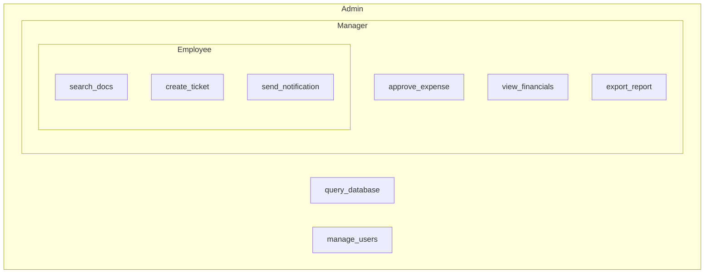

Each level inherits the tools of the one below it and adds its own. It's a simple hierarchy, but it captures something important: access should reflect responsibility, and different users genuinely need different things from the same agent.

### 1.3 The gap

The hierarchy we just described is what you'd want. The problem is that it's not what you get by default.

When you give an agent a set of tools, every user who interacts with it can invoke every tool. There's no built-in enforcement. The agent doesn't know that employees shouldn't be approving expenses, or that database queries should be restricted to admins. It just has tools, and it will use them for whoever asks.

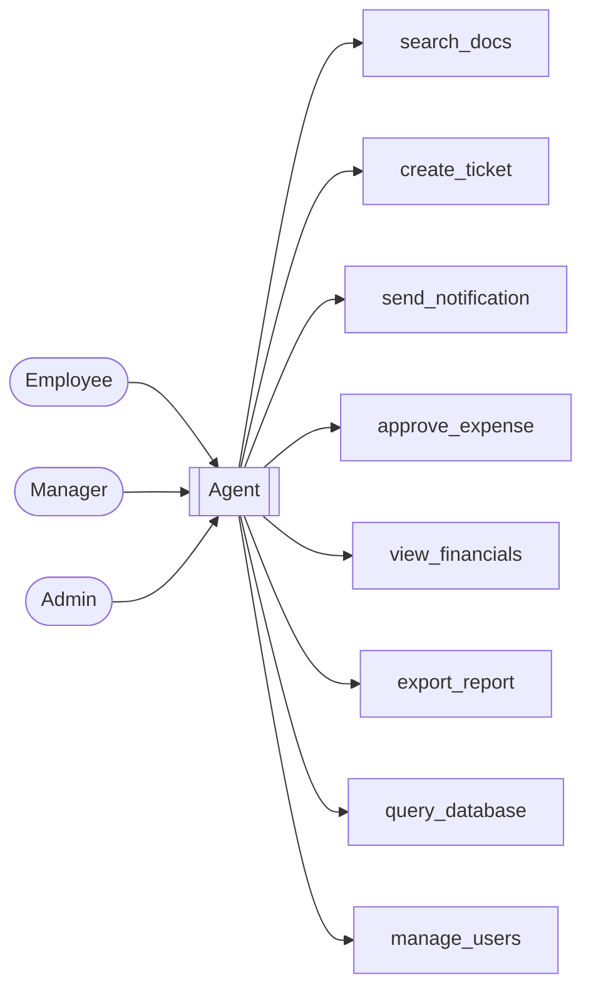

All three users. Same agent. Same tools. No differentiation.

Closing the gap requires answering two questions — and the order matters.

The first question is non-negotiable: **which tools is this user allowed to invoke?** This is answered before the agent starts, and the answer determines exactly which tools the agent is given. If a user can't access a tool, the agent shouldn't know the tool exists. Checking permissions at call time and returning an error is not a substitute — it still means the agent has the tool, can reason about it, and can attempt to use it. The access boundary must be set at instantiation, not enforced reactively.

The second question is additive: **with these specific parameters, is this particular invocation allowed?** This governs fine-grained enforcement within the tools the user already has access to — conditions like approval thresholds, time windows, or resource ownership that go beyond whether the tool is available at all.

The rest of this post is about how to answer both.

## 2. Why this is worth solving

### 2.1 Compliance

In regulated industries, access controls aren't a best practice — they're an audit requirement. Frameworks like SOC 2, HIPAA, and GDPR share a common thread: users should only be able to access what their role justifies, and every access event should be traceable to a specific person.

Agents complicate both of these.

SOC 2 requires demonstrating that sensitive data is accessed only by authorized personnel. If your ops assistant lets any employee call `view_financials` or `export_report`, you can't make that demonstration — regardless of what your role system looks like elsewhere in your application.

HIPAA is more explicit. Its "minimum necessary" standard requires systems to limit access to the information strictly needed for a given task. An agent with a flat tool set has no concept of minimum necessary. It will use whatever tools seem helpful.

GDPR's data minimization principle follows the same logic. An agent that can access more data than the invoking user is entitled to violates the spirit of the regulation, even if it isn't actively misused.

The operational risk compounds all of this. When an agent acts on a user's behalf, audit logs tend to record the agent as the actor — not the user who initiated the conversation. Without tool-level authorization tied to user identity, it becomes difficult to reconstruct who triggered what, which is precisely the question auditors ask.

Tool-level authorization isn't just about preventing misuse. In regulated contexts, it's what makes the system auditable at all.

### 2.2 Business tiers and feature gates

Not every reason to limit tool access is about compliance or security. Sometimes it's purely a product decision.

If you're building an agent as a feature of a SaaS product, the tools the agent can invoke are a direct expression of what each customer tier is paying for. A free user gets `search_docs`. A Pro customer gets `export_report`. An Enterprise customer gets the full set. The access model isn't enforcing security — it's enforcing the product.

The same pattern applies to internal tools. An organization might roll out a powerful capability like `query_database` gradually, starting with one team before expanding access. Or it might restrict tools that trigger expensive operations — certain capabilities carry real infrastructure costs — to the users whose work justifies them.

In all of these cases, tool-level authorization is doing the same job: making sure the right users have access to the right capabilities, for reasons that have nothing to do with threats or regulations. It's product design, enforced at the agent layer.

### 2.3 Security and least privilege

The principle of least privilege has been a cornerstone of security for decades: give a system only the permissions it needs to do its job, and nothing more. If something goes wrong, the damage is bounded by what the system can actually do.

Agents need this more than most.

Unlike traditional software, agents interpret natural language. That means the boundary between intended and unintended behavior is fuzzier. An agent can be manipulated through its inputs — a technique called prompt injection — into taking actions its operator never intended. It can also make reasoning mistakes that lead it to invoke tools in ways the developer didn't anticipate.

In both cases, the blast radius is determined by which tools the agent has access to. An agent that can only call `search_docs` and `create_ticket` can't do much damage if something goes wrong. An agent that also has access to `manage_users` and `query_database` is a different story.

This is why authorization for agents has to be an enforcement problem, not a reasoning problem. The agent's tool set must be defined by deterministic code that reads the user's permissions — not by the agent reasoning about what it should or shouldn't do. You can't rely on a model to implement a security boundary. That boundary belongs in the authorization layer, before the agent is ever instantiated.

## 3. The challenge agents introduce

### 3.1 How traditional apps enforce authorization

Before getting into what makes agents different, it helps to understand how authorization works in a traditional application — because the patterns are well established and agents can learn from them.

In a typical web application, authorization operates at two levels. The first is the UI: the application knows who is logged in, and it renders only the actions that user is allowed to take. Buttons are disabled. Menu items are hidden. An employee using the ops assistant we described earlier would never see an "Approve Expense" button — it simply isn't there for them.

The second level is the backend. The server independently validates permissions before executing any action. This isn't redundancy for its own sake — it ensures that authorization is enforced consistently as a proper second layer of defense.

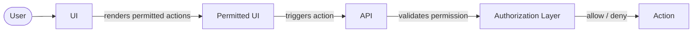

The specific mechanism that powers these checks — role-based rules, attribute conditions, policy engines — is something we'll cover in detail later. But regardless of implementation, the structure is consistent: authorization shapes both what the user sees and what they can actually do.

The same two-layer structure applies to agents. The first layer determines which tools the agent is instantiated with — the equivalent of the UI rendering only permitted actions. The second layer handles fine-grained enforcement at invocation time: not whether the user can access the tool (that was already decided at instantiation), but whether this specific invocation with these specific parameters is permitted. Getting both right is what tool-level authorization for agents is about.

### 3.2 What changes with agents

In a traditional application, the user's intent is explicit. Clicking "Approve Expense" means exactly one thing: invoke the approve-expense endpoint. The action is discrete, the mapping is direct, and the authorization check is straightforward.

With an agent, none of that is guaranteed.

The user sends a message in natural language: "Can you take care of the pending expenses from last week?" The agent interprets that message, decides what it means, and determines which tools to call to fulfill it. It might call `view_financials` to look up pending expenses, then `approve_expense` for each one. Or it might do something slightly different depending on how it reasons about the request. The developer didn't specify the action — the agent inferred it.

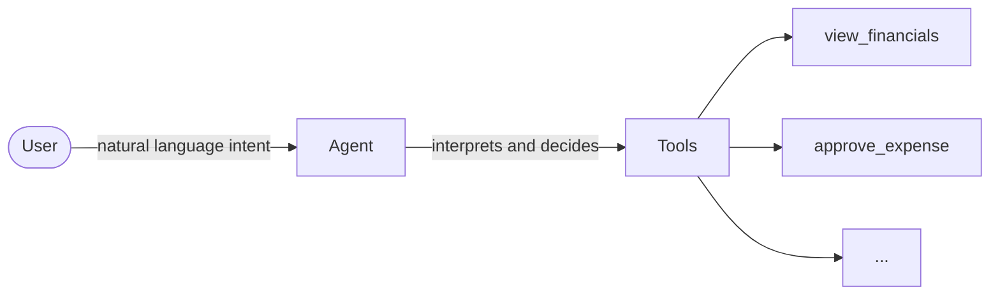

This indirection is what makes authorization harder. In the traditional model, you authorize a specific action the user explicitly asked to perform. In the agent model, you authorize a tool set — a range of capabilities the agent might decide to invoke on the user's behalf, based on its own interpretation of their intent.

The user is no longer making discrete requests. They're delegating to the agent, which means the agent's capabilities become the effective scope of what that user can do. And if those capabilities aren't scoped to the user's permissions, the agent can do far more than the user should be allowed to.

### 3.3 The delegation problem

Here is the crux of it. When a user talks to an agent, they are delegating — handing off the execution of their intent to a system that will act on their behalf. The question is: with whose permissions?

In most implementations, the answer is the agent's own. The agent runs with a service account, API keys, or a token provisioned by the developer. When it calls a tool, it authenticates with those credentials — not the user's. The tool has no inherent knowledge of who initiated the conversation.

This creates a direct mismatch. The user might be an employee who isn't allowed to approve expenses. But if the agent has credentials that permit `approve_expense`, and the user asks it to handle last week's pending approvals, the agent will do it — successfully.

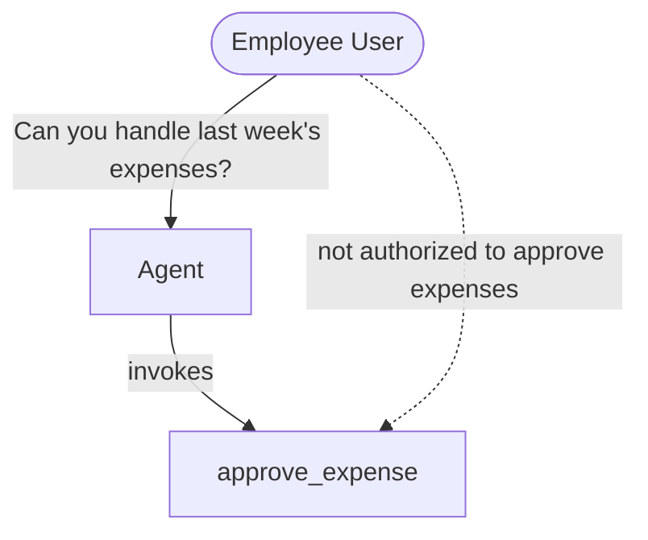

The user didn't do anything wrong. The agent didn't malfunction. The system worked exactly as designed — and that is the problem.

Solving this requires making the user's identity and permissions a first-class part of the agent's execution context. The agent needs to know not just what tools exist, but which tools are available for the specific user it's serving right now. That's what tool-level authorization is about — and as we've seen in traditional applications, the industry has been solving this class of problem for a long time.

## 4. This problem is not new

### 4.1 A brief history

Authorization isn't a new problem. Long before AI agents existed, engineers were wrestling with the same fundamental question: who should be able to do what, and how do you enforce it at scale?

The earliest solutions were access control lists — explicit tables mapping users to permissions. They worked for small systems but became unmanageable fast. In the 1990s, Role-Based Access Control (RBAC) emerged as a cleaner answer: instead of assigning permissions directly to users, you assign them to roles, and users inherit permissions through their role. More auditable, easier to reason about, and it scaled.

But RBAC had limits. It couldn't express conditional access — things like "managers can approve expenses, but only under $1,000." Attribute-Based Access Control (ABAC) addressed this by factoring in context: who the user is, what resource they're accessing, and the circumstances under which the request is being made.

More recently, Relationship-Based Access Control (ReBAC) emerged for collaborative, graph-structured access patterns — "this user owns that document, and owners can share with editors." Google published the Zanzibar paper in 2019, describing the system that powers authorization across Drive, YouTube, and other products, and the model has since influenced a generation of authorization systems.

Each model was built to solve the problems the previous one couldn't handle. Together, they form a toolkit that agents can draw directly from — without reinventing anything.

### 4.2 The key reframe

The mental model that makes all of this tractable is simple.

Traditional access control asks: can this **subject** perform this **action** on this **resource**? Can Alice read this document? Can Bob delete this record? Can this service write to this bucket?

For agent tools, the same structure applies directly:

- **Subject**: the user talking to the agent
- **Action**: invoking the tool
- **Resource**: the tool itself

Can this employee invoke `approve_expense`? Can this manager invoke `export_report`? Can this admin invoke `manage_users`?

But tool invocations don't happen in a vacuum — they come with parameters. And parameters matter. A manager might be authorized to invoke `approve_expense`, but only when the `amount` is below a certain threshold. The tool is permitted; certain invocations of it are not. So the authorization question has two layers:

1. Can this user invoke this tool at all?
2. With these specific parameters, is this particular invocation allowed?

Tools are resources. Invocations are actions. Parameters are part of the context. The user is the subject. Once you see it that way, the models in the next section apply directly — no new mental model required.

### 4.3 A map of the models

The models we'll cover next all answer the same subject/action/resource question, but from different angles — and each is better suited to certain kinds of problems.

- **Role-based (RBAC)**: users are assigned roles, roles carry specific permissions. The most widely used model and the right starting point for most agent tool authorization.
- **Attribute-based (ABAC)**: decisions factor in attributes of the user, the resource, and the environment. Expressive enough to handle conditions like amount thresholds or time windows — things RBAC can't express.
- **Relationship-based (ReBAC)**: authorization derives from a graph of relationships between entities. Well-suited for delegation and resource-specific access patterns.

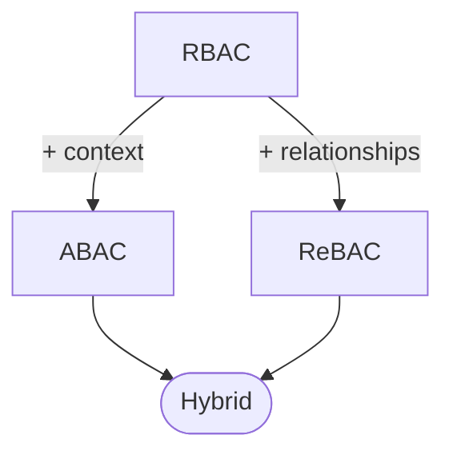

These models aren't used in isolation — they operate at different points in the flow. RBAC is what you query at instantiation time to determine the agent's tool set. ABAC and ReBAC come in at invocation time, enforcing fine-grained conditions on how those tools are used. We'll see how they work together in the hybrid section. For now, let's go through each model in turn.

## 5. The authorization models

### 5.1 Role-based (RBAC)

In RBAC, permissions are attached to roles, and users are assigned to roles. A role is an abstract description of a job function — what someone in that position is responsible for doing. It exists independently of any specific user.

This separation matters. You define what the `Manager` role can do once, as a standalone policy. Then separately, you assign users to that role. Updating the role's permissions — adding a new tool, removing an old one — doesn't require touching user assignments. And assigning a new manager to the system doesn't require duplicating any policy logic. The two concerns are cleanly decoupled.

Roles also support hierarchy. Rather than granting a manager access to employee tools by assigning them to multiple buckets, you define that `Manager` inherits everything `Employee` can do and adds its own permissions on top:

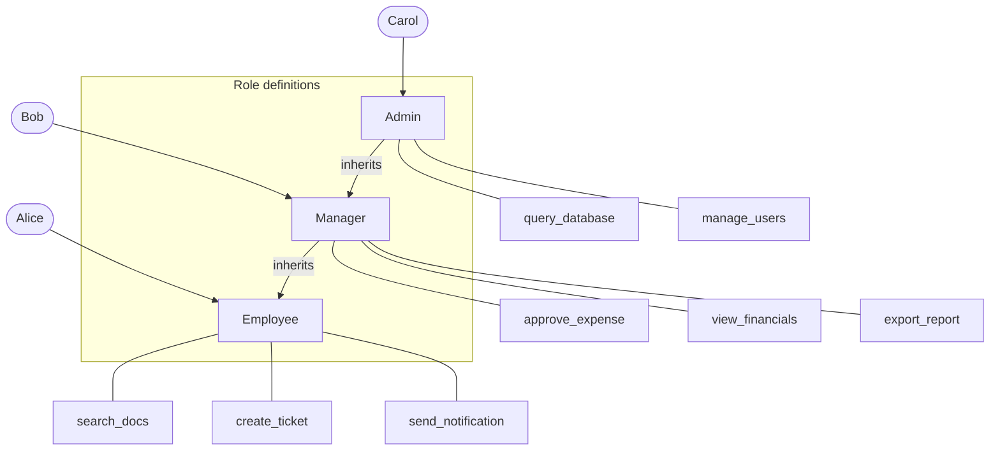

Each role defines only its own permissions. The inherited ones come from the roles below it. A Manager can invoke `approve_expense` because the Manager role grants it — and also `search_docs` because the Employee role grants it, and Manager inherits from Employee. Carol, as an Admin, gets everything.

For agent tool authorization, RBAC maps cleanly. You define a role per user type, assign tools to each role, enforce role hierarchy, and at agent instantiation time you query which tools the user's role permits. The agent is built with exactly that set.

RBAC is the right starting point for most systems. The policies are readable, the model is easy to audit — you can always answer "what can a Manager do?" with a direct lookup — and it covers the majority of tool authorization cases.

Where it runs into a wall is conditions. "Managers can invoke `approve_expense`" is expressible. "Managers can invoke `approve_expense`, but only when the `amount` parameter is below $1,000" is not — not in pure RBAC. Some teams try to work around this by creating more granular roles: `junior_manager`, `senior_manager`, each with different tool sets. But that path leads to role explosion: a proliferating set of roles that becomes hard to manage and harder to reason about.

When you start needing conditions, that's the signal to reach for the next model.

### 5.2 Attribute-based (ABAC)

RBAC answers the question "what role does this user have?" ABAC asks something richer: given everything we know about this user, this tool, these parameters, and the current context — should this invocation be allowed?

Where RBAC expresses permission as membership, ABAC expresses it as a policy evaluated against attributes across multiple dimensions:

- **User attributes**: role, department, clearance level, subscription tier
- **Tool and parameter attributes**: which tool is being invoked, what values are being passed
- **Environment attributes**: time of day, network location, session context

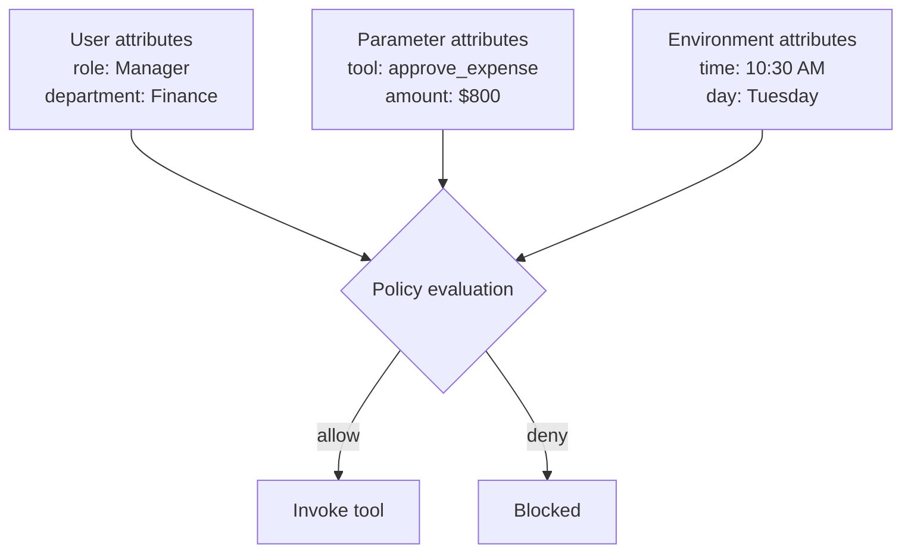

This is what lets ABAC express the condition RBAC couldn't. "Managers can approve expenses, but only under $1,000" becomes a policy rule evaluated at invocation time:

```
allow if:
  user.role == "Manager"
  AND tool == "approve_expense"
  AND params.amount < 1000
```

For the ops assistant, ABAC unlocks a range of controls that RBAC alone can't handle:

- `approve_expense` is available to managers, but only for amounts within their approval limit
- `query_database` is available to admins, but only during business hours
- `export_report` is available to managers in the finance department, not operations

Each of these depends on context — and context is exactly what ABAC is designed to evaluate.

ABAC also addresses the second layer from section 4.2: not just "can this user invoke this tool?" but "can this user invoke this tool *with these parameters*?" That distinction matters as soon as any of your tools take inputs that carry their own sensitivity.

The trade-off is auditability. With RBAC, "what can a Manager do?" is a direct lookup. With ABAC, that same question requires evaluating every policy rule against every possible combination of attribute values — which is computationally and conceptually harder. ABAC policies can also grow complex over time: a rule that starts simple can accumulate conditions until it's difficult to inspect, test, or explain to an auditor.

A common pattern is to layer ABAC on top of RBAC: roles establish which tools are in scope for a given user, and attribute checks refine which specific invocations are permitted within that scope. But this isn't a universal prescription — simpler systems often use RBAC alone, and as we'll see, some access patterns are better expressed with an entirely different model.

### 5.3 Relationship-based (ReBAC)

RBAC asks: what role does this user have? ABAC asks: what are the attributes of this user, this tool, and this context? ReBAC asks a different question entirely: what is the relationship between this user and this specific resource?

The distinction matters more than it might seem. Consider the `approve_expense` tool. Under RBAC, the policy is: "Managers can approve expenses" — meaning any manager can approve any expense. Under ReBAC, the policy becomes: "A user can approve expenses submitted by people they directly manage." The tool is the same. The role is the same. But the authorization is now tied to a specific relationship in the organizational graph.

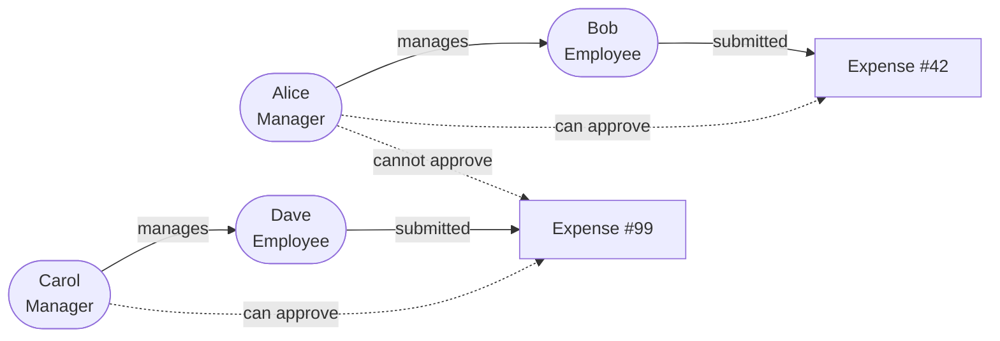

Alice manages Bob, who submitted Expense #42 — so Alice can approve it. Carol manages Dave, who submitted Expense #99 — so Carol can approve it. Alice cannot approve Expense #99, because she has no management relationship to Dave, even though they share the same role.

This is something neither RBAC nor ABAC can express cleanly. RBAC doesn't know about the specific relationship between Alice and Bob. ABAC could approximate it with a `direct_report_ids` attribute on the user, but that attribute would need to be kept in sync with the org structure and injected into every authorization decision — fragile and hard to maintain. ReBAC makes the relationship itself the authorization primitive.

Authorization decisions in ReBAC work by checking whether a path exists in the relationship graph from the user to the resource through a chain of authorized relationship types. "Can Alice approve Expense #42?" becomes: does a path exist from Alice to Expense #42 through `manages → submitted`? If yes, allow. If no, deny.

One property this enables that RBAC and ABAC cannot match: **atomic revocation**. When Bob moves to a different team and the `manages` relationship between Alice and Bob is removed, Alice immediately loses the ability to approve Bob's future expenses. There's no role to update, no attribute to recalculate, no permission to explicitly revoke. Removing the relationship is sufficient — all access derived from it disappears in the same operation.

The trade-off is relationship management overhead. Every authorization-relevant relationship between users and resources needs to be stored and kept current. In an ops assistant with a small team, this is straightforward. At the scale of Google Drive — billions of documents, millions of users, continuous changes — it requires specialized infrastructure, which is exactly what Zanzibar was built to provide.

For most agent tool authorization scenarios, ReBAC is the right model when your access decisions are fundamentally about who has what relationship to whom or to what — approval hierarchies, team ownership, resource-specific delegation. If your authorization logic says "any manager can do X," that's RBAC. If it says "this manager can do X for these specific resources because of how they're related to them," that's ReBAC.

### 5.4 Hybrid models

Before going further, there is one principle that sits above all model choices: an agent must never have access to a tool it shouldn't call. This isn't a preference — it's a security requirement. The tool set the agent is instantiated with must be determined by deterministic code that reads the user's permissions from the authorization layer. Not approximated. Not filtered by the agent after the fact. Defined upfront, before the agent starts.

With that established, the three models we've covered aren't alternatives — they address different aspects of the same authorization problem, and they operate at different points in the agent's lifecycle.

**RBAC answers the instantiation question**: which tools does this user get at all? This is evaluated before the agent starts. An employee's agent is provisioned with `search_docs`, `create_ticket`, and `send_notification`. It knows nothing about `approve_expense` — the tool is simply not there.

**ABAC answers the invocation question**: given the tools the agent has, is this specific invocation permitted? A manager's agent has `approve_expense`, but when the agent tries to call it with an `amount` of $1,500 — exceeding the approval limit — the ABAC check denies it.

**ReBAC answers the resource question**: does the right relationship exist between this user and the specific resource being acted on? A manager's agent invokes `approve_expense` within their limit, but for an expense submitted by someone outside their direct reports — the relationship check fails.

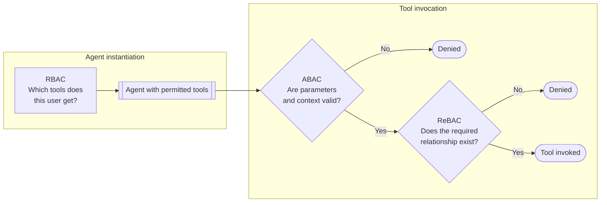

The models handle what they're each best suited for, at the right moment in the flow.

This isn't a prescription to implement all three from the start. Many agent systems need only RBAC, and that's the right call — don't add complexity your requirements don't justify. Attribute conditions are the most common next need, and ABAC extends naturally when they appear. ReBAC enters the picture when authorization depends on specific relationships between users and resources that are meaningful enough to model explicitly.

Think of the models as tools you reach for as your requirements grow, not a stack to implement all at once. Section 7 has a more concrete guide for choosing where to start.

## 6. Where enforcement happens

### 6.0 The two enforcement points

Understanding the authorization models is one thing. Knowing where to enforce them in the actual architecture is another.

There are two enforcement points, and they serve different purposes. The first is mandatory. The second is complementary and applies in specific cases.

**Enforcement point 1: agent instantiation (mandatory)**

Before the agent starts, something in your architecture must determine which tools this user is permitted to invoke, and the agent must be built with exactly that set. The mechanism varies: it might be a JWT containing permission scopes, a role lookup against your authorization system, or OAuth token claims that indicate which capabilities the user has. The specific approach depends on your architecture. What doesn't vary is the requirement: the agent's tool set must reflect the user's permissions before the agent starts reasoning.

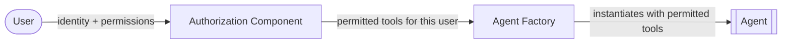

This is non-negotiable. Giving the agent all tools and hoping it won't use the ones it shouldn't is not a security control. The agent will reason about every tool it has, and it can be manipulated through prompt injection into using tools it knows about. The only safe position is for unauthorized tools to not exist in the agent's context at all.

**Enforcement point 2: somewhere in the invocation path (complementary)**

There are cases where two users have access to the same tool but with different permission scopes. Consider two managers: one with an approval limit of $1,000 and another with $10,000. Instantiation-time provisioning can't distinguish between them — both get `approve_expense`. What differs is how they're allowed to invoke it.

In these cases, a parameter-level authorization check needs to happen somewhere in the invocation path. Where exactly depends on your architecture:

- **Inside the tool**: the tool reads user context from agent state and checks permissions before executing. Most agentic frameworks support agent state — a context object accessible inside tool calls — where user identity and attributes can be injected at startup.
- **In an external API**: the tool calls an API that enforces its own authorization. The API validates the request against the user's permissions and rejects it if it's out of scope. In this case, the tool itself doesn't need to implement any authorization logic.
- **In a middleware layer**: a gateway or interceptor sits between the agent and the tool, evaluating the invocation against policy before allowing it through.

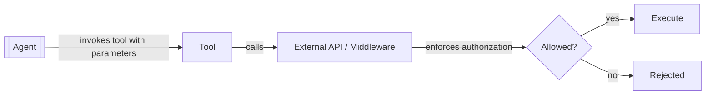

The important thing is that it happens somewhere before the action executes. The architecture is flexible; the requirement is not.

**The two points work together.** Instantiation-time provisioning ensures the agent can't reach tools it shouldn't have. Invocation-time enforcement ensures it can't misuse the tools it does have. The sections that follow cover the specific mechanisms — OAuth scopes, middleware, and policy engines — that you can use to implement each point.

### 6.1 OAuth scopes

OAuth scopes are the most familiar authorization primitive for developers building applications that call external APIs. When a user authenticates, they consent to a set of scopes — a declaration of what the application is allowed to do on their behalf. The authorization server encodes those scopes into an access token, and every downstream API call is gated by whether the required scope is present.

For agent tools that call external services — an expense platform, a CRM, a data warehouse — scopes are a natural and standards-compliant access layer. If the token doesn't carry the `expenses:write` scope, the expense API rejects the call. That check happens at the API level, without any extra logic in your agent.

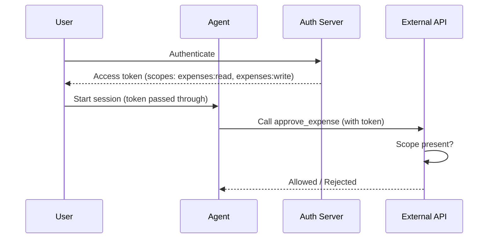

If you map each tool to a scope, scopes can also drive instantiation-time provisioning. At startup, read the scopes from the user's token, and build the agent with only the tools those scopes permit. For simpler systems — where the authorization question is purely "does this user have access to this tool at all?" with no parameter-level conditions — this approach can be sufficient on its own.

Where scopes run into limits is when fine-grained conditions enter the picture. Scopes are coarse — they gate access to a tool or operation category, but they can't express rules like "this user can approve expenses up to $1,000" or "this user can only export reports for their own department." Tokens are also static after issuance: the scopes encoded at login time can't change mid-session, and revoking a scope requires token expiry or active introspection.

For systems where tool-level gating is enough, scopes are a clean and low-overhead solution. When you need parameter-level enforcement on top of that, scopes handle the outer layer and you add a complementary mechanism for the rest.

### 6.2 Pre-dispatch middleware

A middleware gate is a layer of code that sits between the agent's decision to invoke a tool and the tool's actual execution. The agent calls a central dispatcher; the dispatcher reads user context, evaluates permission rules, and either forwards the call to the tool or rejects it.

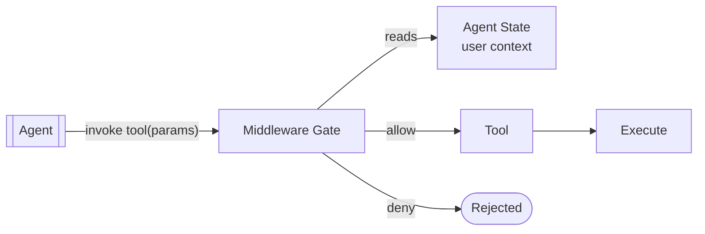

The middleware can serve both enforcement points. At instantiation time, it can filter the list of available tools based on the user's role before passing them to the agent. At invocation time, it evaluates parameter-level conditions — approval limits, department checks, time windows — before the tool runs.

A simple implementation looks something like this:

```
function dispatch(tool_name, params, user_context):
    if tool_name not in permitted_tools(user_context.role):
        raise AuthorizationError("tool not permitted")
    if not check_conditions(user_context, tool_name, params):
        raise AuthorizationError("invocation not permitted")
    return tools[tool_name](params)
```

This approach has a lot going for it early on. It requires no external dependencies, keeps authorization logic in one place, and gives you full control over how rules are evaluated. For smaller systems or early-stage products where the permission model is still evolving, it's often the right place to start.

The friction appears as the rule set grows. Authorization logic encoded in application code must be redeployed every time a rule changes. More importantly, it tends to drift — conditions accumulate, edge cases get added inline, and what started as a clean central gate becomes a tangle of conditionals spread across the codebase. At that point, the policy is hard to inspect, hard to test independently, and hard to hand to an auditor.

When you find yourself wanting to manage authorization logic separately from application code — version it, test it in isolation, update it without a deploy — that's the signal to consider moving to a policy engine.

### 6.3 Policy engines

A policy engine externalizes authorization logic into declarative policies that live outside your application code. Instead of embedding permission rules in a dispatcher or a tool, the application asks the policy engine a question — "is this user allowed to invoke this tool with these parameters?" — and the engine evaluates the current policy and returns a decision.

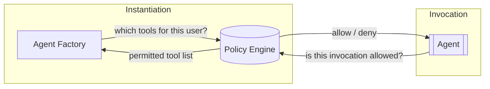

The policy itself is written in a declarative language and stored separately from the application — in a file, a repository, or the engine's own storage. A rule that governs `approve_expense` might look like this:

```
allow if:
    input.user.role == "manager"
    input.params.amount <= input.user.approval_limit
    input.time.hour >= 9
    input.time.hour <= 17
```

This is the same logic that would otherwise live in application code — but now it's in a policy file that can be read, reviewed, and updated independently. Change the approval limit threshold, adjust the time window, add a department condition: the policy changes, the application doesn't.

This separation is what makes policy engines valuable in regulated or audited environments. The authorization rules are inspectable as a standalone artifact. They can be version-controlled alongside the rest of your codebase, tested in isolation, and handed to a compliance team without requiring them to navigate application logic.

Tools like OPA (Open Policy Agent), Cedar, and Cerbos are common choices, each with their own policy language and evaluation model. They differ in expressiveness, performance characteristics, and how well they handle ABAC versus ReBAC patterns — but the architectural pattern is the same: your application becomes a policy decision client, and the engine is the policy decision point.

The trade-off is operational overhead. A policy engine is an additional component to deploy, operate, and integrate. Policy languages have a learning curve, and debugging a failed authorization decision in a declarative language is a different skill than debugging application code. For small systems with simple, stable rules, this overhead may not be justified. As rules grow more complex and more people — developers, security teams, auditors — need to reason about them, the investment pays off.

## 7. Choosing your approach

### 7.1 Start with the right question

Before reaching for a model or a mechanism, it's worth spending a moment on what your authorization requirements actually are. The right starting point varies significantly depending on the nature of your access control problem, and the wrong choice creates friction that compounds over time.

Two questions cut through most of the decision:

**What determines whether a user can invoke a tool?**

If the answer is purely their role or user type — "managers can approve expenses, employees cannot" — RBAC is likely sufficient. If the answer involves conditions on the invocation itself — "managers can approve expenses, but only under their approval limit" — you need ABAC on top. If the answer involves the specific relationship between the user and the resource being acted on — "managers can approve expenses submitted by their direct reports" — ReBAC is the right fit.

**How stable and auditable do your rules need to be?**

If your rules are small in number, unlikely to change frequently, and don't need to be reviewed by anyone outside your team, middleware is a reasonable place to start. If your rules need to be updated independently of application deployments, inspectable by a compliance or security team, or testable in isolation, a policy engine is the better long-term foundation.

These two questions map to the two enforcement points from section 6: the first shapes how you build the agent's tool set at instantiation; the second shapes how you implement invocation-time checks. Answer them separately, because the right choice for each doesn't have to be the same.

### 7.2 A decision map

**Choosing your authorization model:**

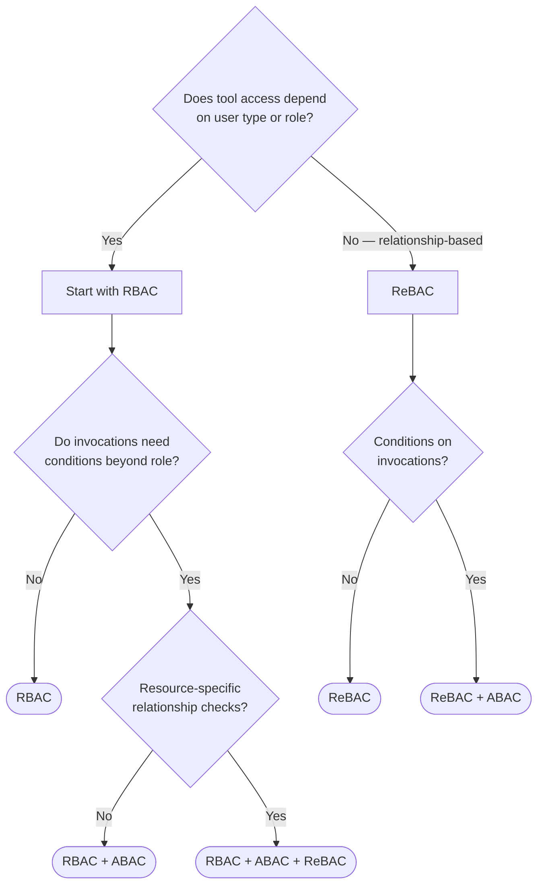

**Choosing your enforcement mechanism:**

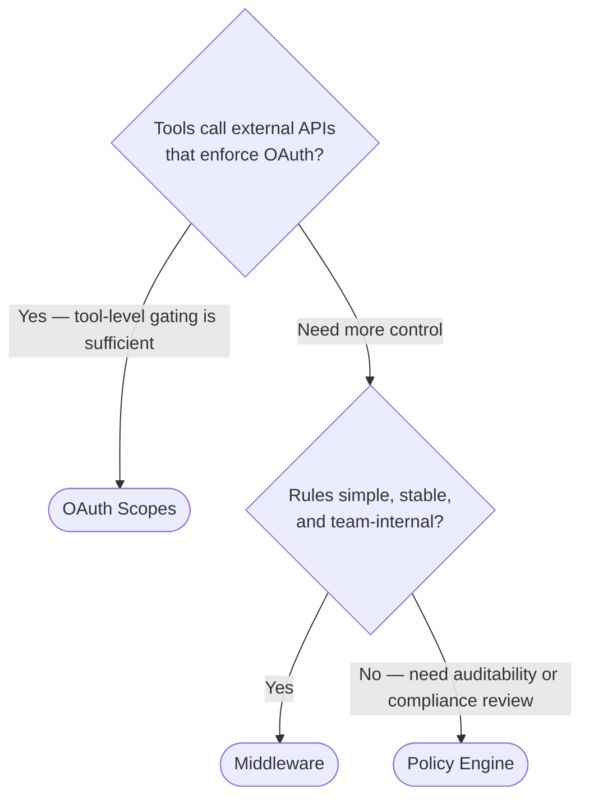

The two maps are independent. You might use RBAC + ABAC for your authorization model and middleware as your enforcement mechanism. Or ReBAC with a policy engine. The model choice is about the logic of your authorization rules; the mechanism choice is about where and how you evaluate them.

### 7.3 Design for growth

The most common mistake isn't picking the wrong model — it's embedding authorization logic directly in individual tools, scattered across the codebase, with no central enforcement point. Once you're there, you can't answer basic questions like "what can a manager do?" without reading every tool's implementation. Every new tool requires manually adding the same checks. Auditing becomes archaeology.

The central enforcement point is the first thing to get right. Whether it's an OAuth scope check, a middleware gate, or a policy engine matters less than having a single, deliberate place where authorization decisions are made. Everything else can be improved incrementally.

From there, the signals for evolving are usually clear:

- **Role explosion**: you keep creating new roles to handle edge cases. That's the signal for ABAC — conditions should be expressed in policies, not as role variants.
- **Rules drifting into tools**: authorization logic has started accumulating across individual tool implementations rather than staying centralized. Time to establish or reinforce the middleware gate.
- **Audit requests**: someone asks you to prove which users can do what, or compliance requires an independent review of your authorization rules. If those rules live in application code, that conversation is painful. A policy engine makes it tractable.
- **Relationship-dependent access**: you find yourself maintaining lists of "authorized users per resource" and keeping them in sync by hand. That's the shape of a ReBAC problem.

Start with what your current requirements justify. Add complexity only when the signals are clear. And from the beginning, hold the one principle this post keeps returning to: the agent's tool set is determined by your authorization layer, not by the agent's own reasoning. That boundary is the foundation everything else is built on.
